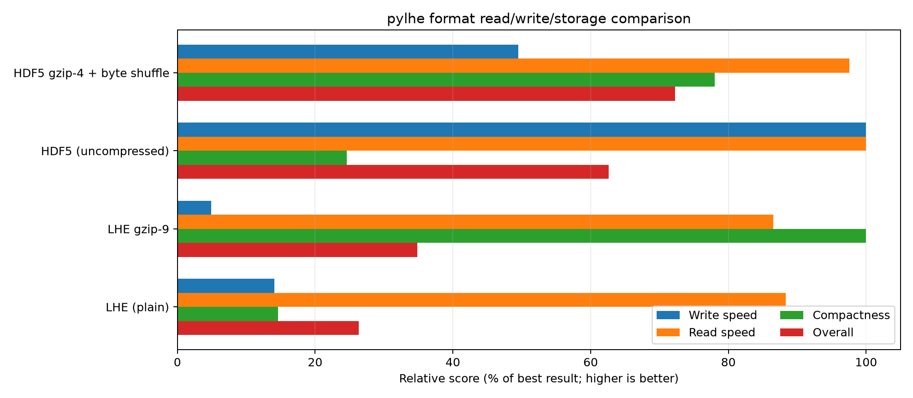

Comparison
==========

Performance
-----------

The results were produced with the
:download:`benchmark script <examples/benchmark_io_formats.py>`.

   Read and write performance for chunked compressed and uncompressed LHEH5 files. Overall is the geometric mean of relative read, write and storage performance.
